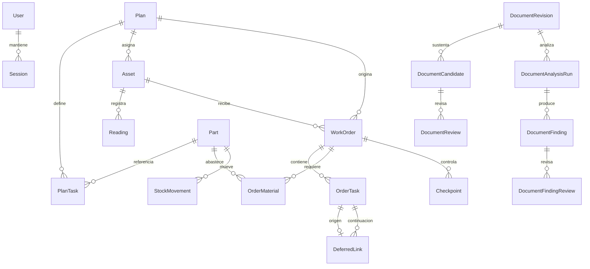

# Modelo de dominio vigente

Estado: vigente para el esquema Prisma y la API observados en la base `c8e2efb`. Este documento describe 21 modelos persistidos; no amplía el alcance ni convierte datos del corpus en hechos técnicos.

## Contextos

| Contexto | Entidades | Responsabilidad |
|---|---|---|
| Identidad y acceso | `User`, `Session` | Usuarios, roles y sesiones servidor |
| Activos | `Asset`, `Reading` | Equipo mantenible y lecturas monotónicas |
| Planificación | `Plan`, `PlanTask` | Planes revisados y tareas con procedencia |
| Ejecución | `WorkOrder`, `OrderTask`, `DeferredLink`, `Checkpoint` | Snapshot de intervención, ejecución, continuidad y liberación |
| Inventario | `Part`, `OrderMaterial`, `StockMovement` | Catálogo, demanda, reserva, consumo y movimientos |
| Trazabilidad | `Audit`, `Idempotency` | Eventos auditables y replay seguro |
| Inteligencia documental | `DocumentRevision`, `DocumentCandidate`, `DocumentReview`, `DocumentAnalysisRun`, `DocumentFinding`, `DocumentFindingReview` | Evidencia externa, propuestas y decisión humana |

## Relaciones principales

`Audit` e `Idempotency` se vinculan por identificadores y scopes, no mediante foreign keys. `actorId` tampoco tiene foreign key hacia `User`; la auditoría conserva además `actorName` como snapshot.

## Agregados y límites

### Activo y planificación

- `Asset` mantiene código único, nombre, familia, lectura actual, estado operativo y plan opcional.
- Cada `Reading` conserva valor, actor y fecha; no reemplaza la lectura anterior.
- `Plan` se versiona por `(code, revision)` y contiene `PlanTask` únicas por código dentro de la revisión.
- `PlanTask.sourceType` y `sourceReference` conservan procedencia; valores desconocidos permanecen `A_CONFIRMAR`.

### Orden de trabajo

- `WorkOrder` es la raíz transaccional de ejecución.
- Guarda snapshots JSON de activo y plan para que cambios futuros no reescriban la historia.
- `OrderTask`, `OrderMaterial` y `Checkpoint` son detalles operativos de la orden.
- `DeferredLink` enlaza una tarea diferida con una tarea de continuidad posterior.
- Sólo puede existir una orden `OPEN` por activo.

### Inventario

- `Part` es el registro de catálogo con `onHand` y `reserved`.
- `OrderMaterial` representa cantidades previstas, reservadas y usadas dentro de una OT.
- `StockMovement` registra eventos positivos `RECEIVE`, `RESERVE`, `CONSUME` o `RELEASE`; el sentido se interpreta por `kind`.
- `available` no se persiste: la API calcula `onHand - reserved`.

### Inteligencia documental

- `DocumentRevision` identifica una revisión externa por `(sourceId, sha256)` y es inmutable.
- `DocumentCandidate` es una propuesta de catálogo; `version` implementa concurrencia optimista.
- `DocumentReview` conserva decisiones humanas versionadas: `A_CONFIRMAR`, `VALIDADO` o `RECHAZADO`.
- `DocumentAnalysisRun` identifica una ejecución única por revisión, analizador y versión.
- `DocumentFinding` es una propuesta asistida con `stockEffect = NONE`; su estado visible puede cambiar mediante revisión.
- `DocumentFindingReview` es append-only. `CREATE_CANDIDATE` registra intención o derivación, pero nunca aplicación al catálogo.

## Snapshots y referencias

| Dato | Persistencia | Motivo |
|---|---|---|
| Activo/plan aplicados a una OT | `assetSnapshot`, `planSnapshot` | Historia inmutable |
| Parte usada en una OT | `partSnapshot` | Tarjetas y evidencia histórica |
| Nombre de actor de auditoría | `Audit.actorName` | Preservar identificación visible histórica |
| Nombre de revisor documental | Resuelto desde `User` al consultar | No es snapshot histórico; puede ser `null` |
| Fuente externa | `sourceId`, SHA-256 y locator | Trazabilidad sin copiar originales |

## Aspectos no modelados todavía

No existen como entidad propia: componentes jerárquicos del activo, ubicación de stock, proveedor, compra/RFQ, herramienta, EPP, correctivo completo, calendario de mantenimiento, unidad del medidor ni propietario documental. Son planificación futura, no campos implícitos que puedan inferirse.
