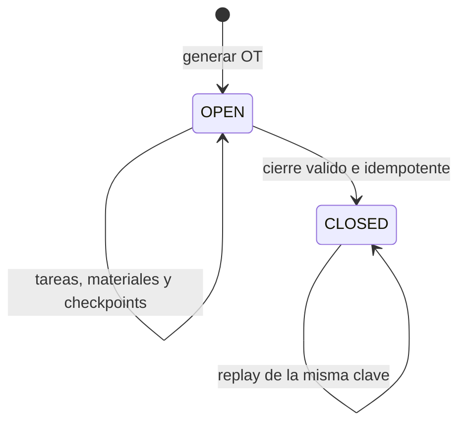
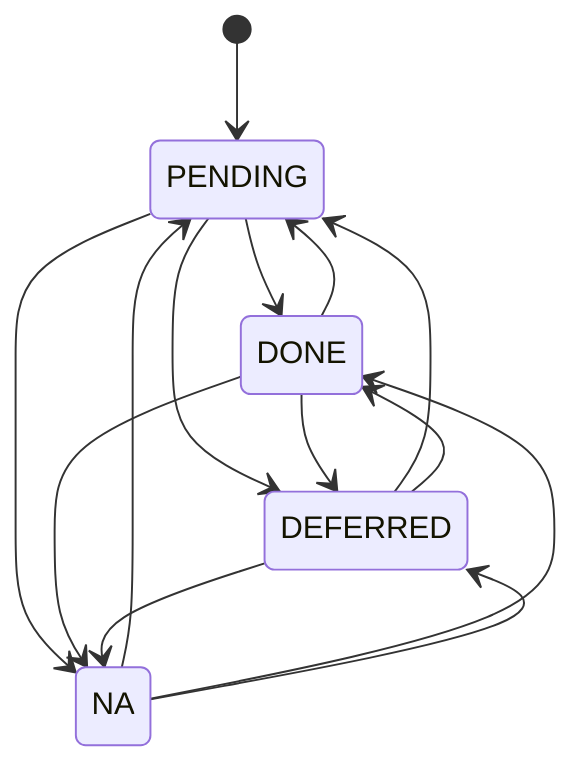

# Estados y transiciones

Estado: descripción de las transiciones implementadas. Los valores almacenados como `String` se documentan aquí, pero eso no equivale a un enum de base de datos.

## Orden de trabajo



- No existe cancelación ni reapertura.
- Toda mutación operativa bloquea la fila y exige `OPEN`.
- El cierre requiere tareas obligatorias resueltas, tareas bloqueantes `DONE`, checkpoints críticos `PASS` y consumo real suficiente para tareas realizadas.
- `OPERATIVE` no admite tareas `DEFERRED`.
- `OPERATIVE_WITH_NOTES` y `NOT_OPERATIVE` exigen notas.
- Cualquier resultado de cierre queda bloqueado si un checkpoint crítico está `PENDING` o `FAIL`.

El resultado de cierre actualiza `Asset.operatingStatus` con `OPERATIVE`, `OPERATIVE_WITH_NOTES` o `NOT_OPERATIVE`. El valor inicial puede ser `A_CONFIRMAR`. No hay una máquina independiente persistida para el activo.

## Tarea de orden



La API admite cambios entre los cuatro estados mientras la OT esté abierta. Restricciones:

- Una tarea `blocking` no puede quedar `DEFERRED` ni `NA`.
- `DEFERRED` exige motivo y fecha actual o futura; el actor autenticado queda como responsable.
- Al cambiar a otro estado se limpian motivo, fecha y responsable de diferimiento.
- Una tarea `DONE` con material asociado requiere consumo suficiente antes del cierre.

## Checkpoint

Estados: `PENDING`, `PASS`, `FAIL`, `NA`.

- La API permite cambiar el resultado mientras la OT esté abierta.
- Un checkpoint crítico no admite `NA`.
- Todo checkpoint crítico debe estar `PASS` para cerrar, incluso con resultado `NOT_OPERATIVE`.

## Candidato documental

`DocumentCandidate.version` comienza en 0. Cada revisión válida compara la versión esperada, incrementa el candidato y agrega un `DocumentReview` inmutable.

```text
version N + decisión humana
        ├── A_CONFIRMAR
        ├── VALIDADO
        └── RECHAZADO
                  ↓
version N+1 + evento append-only
```

Una revisión concurrente sobre una versión vencida recibe `REVIEW_STALE`. El candidato no se aplica al catálogo desde este flujo.

## Hallazgo documental

Estados visibles: `A_CONFIRMAR`, `CREATE_CANDIDATE`, `REJECTED`, `OCR_REQUIRED`, `CONFLICT`.

- ADMIN y TECHNICIAN pueden registrar cualquiera de esas decisiones con motivo.
- Cada decisión agrega `DocumentFindingReview`; el historial es append-only.
- Sólo ADMIN puede derivar un hallazgo `PART_CANDIDATE` con código confirmado a `DocumentCandidate`.
- La derivación marca `CREATE_CANDIDATE`, es idempotente y conserva `stockEffect = NONE`.
- `EQUIPMENT_REFERENCE`, `OCR_REQUIRED` y otros tipos no son partes derivables.

## Sesión

Una sesión nace tras login válido, expira a las ocho horas o termina por logout. Usuarios inactivos y sesiones vencidas son rechazados. No existe renovación deslizante documentada ni implementada.
